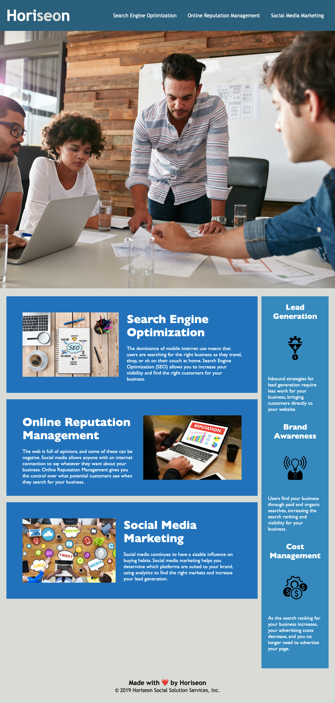

# Marketing-Agency-Accessibility

## Description

This marketing agency website can be used to learn more about the services and benefits the agency provides.

The primary objective of this project was to improve accessibility by refactoring existing code. 
This was accomplished by improving the semantics of the HTML and adding alt attributes to images. 

The secondary objective of this project was to refactor the styling code of the website. This was accomplished by consolidating CSS elements to make the code more efficient. 

## Installation

N/A

## Usage

This website can be used to learn more about the services and benefits provided by this marketing agency. The website is accessible to visitors using screen readers. 

[Deployed Website Link](https://ameliabigler.github.io/Marketing-Agency-Accessibility/)

## Credits

Video Tutorial
["Learn CSS Position in 9 Minutes" by WebDevSimplified](https://www.youtube.com/watch?v=jx5jmI0UlXU)

## License

Please refer to the license in the repo.